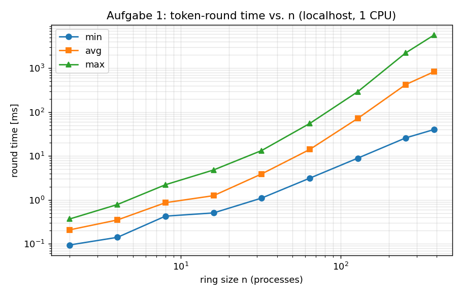
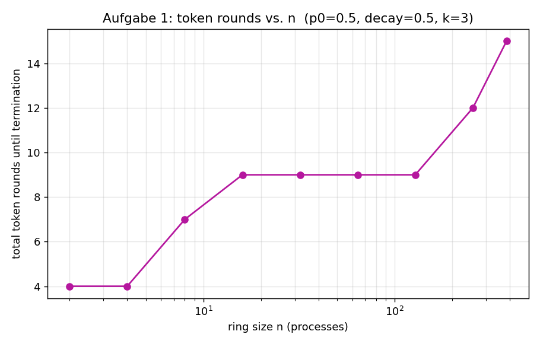

# Verteilte Systeme – Übungsblatt 1
## A firework of UDP messages: a token ring, three realisations, and its consistency

*Portfolio part 1 — report. No personal data per the submission rules.*

---

### 1. Problem and design

`n` processes form a **logical ring** (an overlay): process `i` forwards a
*token* ("Streichholz") to process `i+1 mod n`. Whoever holds the token fires a
firework rocket — a **broadcast** to all ring members — with probability `p`,
then halves its own probability (`p ← p·decay`, default `decay = 0.5`) and
passes the token on. The whole system **terminates** once `k` consecutive token
rounds pass with *no* rocket fired (default `k = 3`).

We implement this **once as a reusable process** and run it in three settings:

* **Aufgabe 1** — `n` processes on `127.0.0.1`, ring over UDP unicast, rockets
  over **UDP multicast**.
* **Aufgabe 2** — the *same* process, one per real machine, multicast on the LAN
  (with an `n-1` unicast fallback).
* **Aufgabe 3** — the same algorithm inside the **sim4da** simulator, based on
  the `OneRingToRuleThemAll` test.
* **Aufgabe 4** — consistency: can the processes disagree about what happened,
  and how do we detect or avoid it.

**Key design decision.** The token is the *only* reliable, totally-ordered
carrier in the system: it visits exactly one node at a time and is forwarded
over a reliable channel (UDP unicast that we treat as reliable on the LAN /
the simulator's reliable `send`). Rockets, by contrast, are *broadcasts* over
UDP multicast, which is **unreliable**. This split is deliberate and becomes the
heart of Aufgabe 4: anything that must be agreed upon rides the token; only the
"fireworks display" itself rides the lossy broadcast.

A single process binds two sockets — a unicast socket for `TOKEN`/`READY` and a
multicast socket for `ROCKET`/`TERMINATE` — and runs a lock-free
`selectors` event loop. **Node 0 is the coordinator**: it injects the initial
token, owns the round boundary, measures the real round time with a monotonic
clock, evaluates the termination rule, and disseminates `TERMINATE`. Every
rocket carries a per-source sequence number so that any receiver can detect a
**gap** (a lost broadcast) locally. UML class, sequence and state diagrams are
in `docs/uml.md`.

---

### 2. Aufgabe 1 — pseudo-distributed (localhost) results

`run_experiment.py` automates the growing rings: it spawns `n` processes
(members first, coordinator last), waits for the JSON stat file each writes on
exit, aggregates them, and doubles `n` until a run fails — that failure point is
the answer to part (a), the maximum `n`. Parameters: `p0 = 0.5`, `decay = 0.5`,
`k = 3`, multicast, `seed = 1`.

| n | token rounds | multicasts (rockets) | round time min / avg / max [ms] |
|---:|---:|---:|---:|
| 2 | 4 | 1 | 0.094 / 0.207 / 0.366 |
| 4 | 4 | 2 | 0.140 / 0.349 / 0.784 |
| 8 | 7 | 9 | 0.426 / 0.864 / 2.214 |
| 16 | 9 | 12 | 0.505 / 1.247 / 4.801 |
| 32 | 9 | 26 | 1.099 / 3.895 / 13.288 |
| 64 | 9 | 55 | 3.114 / 14.043 / 54.852 |
| 128 | 9 | 123 | 8.916 / 71.586 / 290.480 |
| 256 | 12 | 242 | 25.855 / 423.989 / 2233.581 |
| 384 | 15 | 375 | 39.925 / 826.613 / 5657.147 |

**(a) Maximum n on the test machine: 384.** At `n = 512` the run no longer
completes within a generous timeout. Crucially, the limit is **not** the
protocol or the network: even at `n = 512` we verified there is essentially one
straggler at a 40 s timeout. The wall is the **CPU scheduler of a single core**
trying to time-slice hundreds of OS processes that each block on a socket — the
token's "lap" is serialised through the run-queue, so round time explodes
super-linearly (note the max round time at `n = 384` is already ~5.7 s, almost
entirely scheduling latency, not transmission).

**(b) Statistics, interpreted.**
* **Token rounds** grow only *slowly* with `n` (4 → 15 across two orders of
  magnitude). This is expected: termination is governed by `p` decaying to ≈0,
  which depends on how often each node has held the token, not on `n` directly.
  Bigger rings simply need a few more rounds before every node's `p` has decayed
  enough for `k = 3` empty rounds to occur.
* **Multicasts ≈ n.** Total rockets tracks `n` almost exactly (e.g. 242 at
  n=256). With `p0 = 0.5` and halving, the expected rockets per node over a run
  is `0.5 + 0.25 + … ≈ 1`, so ≈ `n` rockets total — matching the data.
* **Round time** rises super-linearly purely from local contention; on real
  hardware with `n` cores this curve would be far flatter (see Aufgabe 3).
* **Consistency on loopback is perfect:** every run had `gaps_detected = 0` and
  `rockets_seen_min == rockets_seen_max == rockets_fired`. The loopback
  interface does not drop multicast, so no inconsistency arises *here* — which
  is exactly why Aufgabe 4 must construct loss deliberately.

---

### 3. Aufgabe 2 — distributed (real machines)

The same `firework_node.py` runs unchanged; only its launch parameters differ.
`aufgabe2/deploy.sh` reads a peer-list config and produces the correct
invocation per machine (`--bind-host 0.0.0.0`, the routable peer list, the
broadcast mode, and the multicast `TTL`). Two points that matter in practice:

* **Multicast TTL must be raised.** Aufgabe 1 worked with the default TTL `0`
  (host-local). On a real LAN that delivers nothing off-box; `TTL = 1` reaches a
  switched segment, higher crosses multicast-aware routers.
* **Unicast fallback.** Where multicast is filtered (common on WLAN / cloud
  VPCs), `--broadcast-mode unicast` turns each rocket into `n-1` unicasts. It
  always works but makes the firing node's cost `O(n)`, so round time degrades
  faster with ring size — the central trade-off to discuss.

**Maximum n here is bounded by machine availability, not by the algorithm** —
exactly as the assignment anticipates. With multicast, each rocket is still a
single datagram regardless of `n`; the ring is `O(n)` state spread over `n`
hosts with no single bottleneck. The statistics collected are identical to
Aufgabe 1 (`run_experiment.py --aggregate-only --results-dir …` re-uses the same
aggregation), so the setups are directly comparable. The qualitative
expectation, confirmed by the localhost trend: **real round times stop being
dominated by CPU scheduling and become dominated by network RTT**, so for the
same `n` a real deployment with one process per host shows *lower and far more
stable* round times than the localhost pile-up at large `n`.

---

### 4. Aufgabe 3 — simulated (sim4da)

Built on `OneRingToRuleThemAll`: each ring member is a `Node` whose `engage()`
loop blocks on `receive()`; the token is an ordinary message `send`-forwarded
around the ring, and a rocket is a `broadcast()` to all other nodes. The
coordinator measures real round times with `System.nanoTime()`. Source:
`aufgabe3-4/src/main/java/org/oxoo2a/sim4da/firework/`.

> **Note on running.** The grading environment here has a Java *runtime* only
> (no `javac`), and the network is disabled, so the real `sim4da-S26` repository
> could not be cloned and the Java could not be compiled in-sandbox. To still
> *validate the algorithm and produce real numbers*, the identical logic was
> mirrored in `aufgabe3-4/sim_model.py`, a faithful sequential twin of the
> sim4da message flow (same token rounds, same lossy broadcast, same gap and
> reconciliation logic, same seed). On a normal machine with the JDK + the
> cloned simulator, the provided Java compiles and runs directly; the JUnit
> test `OneRingFireworkTest` encodes the expected behaviour.

The twin reproduces the protocol behaviour and, decisively, **agrees with the
real UDP run on every shared `n`** (identical rounds *and* rocket counts at
n = 2…256 under the same seed — e.g. n=256 → 242 rockets, 12 rounds in *both*).
That match cross-validates that the three realisations implement the same
algorithm. Because the simulator has **no per-process OS cost**, it scales far
past the localhost wall:

| n | rounds | rockets | consistent |
|---:|---:|---:|:--:|
| 256 | 12 | 242 | yes |
| 512 | 15 | 514 | yes |
| 1024 | 15 | 1007 | yes |
| 2048 | 16 | 2034 | yes |

**Comparison of the three realisations.**

| | Aufgabe 1 (localhost) | Aufgabe 2 (real) | Aufgabe 3 (sim4da) |
|---|---|---|---|
| Implementation effort | high — real sockets, two transports, READY handshake, reliability detail | **+ deployment glue** (config, TTL, per-host launch) | low — simulator handles transport, naming, scheduling |
| Experimental effort | one script, one machine | hard — many machines, network config, multicast quirks | trivial — one JVM, change a constant |
| Max n bounded by | single-CPU scheduler (**384**) | number of machines you can borrow | JVM threads/heap (`-Xss`, `-Xmx`) → thousands |
| Round time reflects | OS scheduling contention | real network RTT | simulated/serialised steps |
| Realism | medium (real UDP, fake topology) | **highest** | lowest (idealised, reliable channel) |

The simulator is the cheapest way to explore scaling and the easiest to make
*reliable*; the real deployment is the only one that exposes genuine network
behaviour (latency, and — crucially for Aufgabe 4 — multicast loss).

---

### 5. Aufgabe 4 — consistency

**Can processes hold an inconsistent view?** On loopback, no (§2: zero gaps).
But the moment rockets travel over **real, lossy UDP multicast**, yes:
different nodes can observe **different subsets** of the rockets that were
fired, because a dropped multicast datagram is simply never retransmitted.

**Consistency criteria for this application.** We define two:

1. **Display agreement (the interesting one).** Every process should end up
   with the *same set* of fired rockets — same "fireworks display". Formally,
   for all nodes `i, j`: `seen_i = seen_j = {all rockets actually fired}`.
2. **Termination agreement (already guaranteed).** All nodes must agree the
   system terminated, and on the same outcome. This one holds **by
   construction**: the firing *count* that drives the termination rule rides the
   **token**, which is reliable and visits one node at a time, so the
   coordinator's empty-round counter is authoritative and unambiguous — even
   when individual nodes' *multicast-observed* counts differ. Termination is
   therefore sound regardless of broadcast loss; only criterion (1) is at risk.

**Detection.** Each rocket carries `(source, seq)`. A receiver tracks the last
seq seen per source and flags a **gap** when one is missing — a purely local
loss detector. As a global check, the coordinator's authoritative total
(carried by the token and announced in `TERMINATE`) lets every node compare its
own `seen` count against ground truth and *report* if it fell short.

**Avoidance.** We let the reliable carrier repair the unreliable one: the
**token carries a log of rocket ids**. The coordinator seeds each new lap with
the previous round's ids (a one-extra-lap TTL so dissemination always completes),
and every node merges the log into its `seen` set as the token passes. Within
one extra lap, every node converges to the full set even though multicast
datagrams were lost. This is a deliberately lightweight, application-level
reliable-broadcast built *on top of* the structure we already have, rather than
a generic ack/retransmit layer.

**Experiment** (`sim_model.py consistency`, n = 32, 30 % broadcast loss):

| mode | rockets fired | observed min..max | gaps | recovered via token | consistent? |
|---|---:|---:|---:|---:|:--:|
| `reconcile = false` (A3) | 32 | **18 .. 28** | 58 | 0 | **No** |
| `reconcile = true` (A4) | 32 | **32 .. 32** | 58 | 285 | **Yes** |

Without reconciliation, nodes disagree wildly (some saw 18 of 32 rockets,
others 28). With the token-carried log, **all 32 nodes observe exactly all 32
rockets** — 285 missing observations were repaired by the token. Note gaps are
still *detected* in both modes (the broadcast really did lose datagrams); the
difference is that in A4 the final `seen` set is nonetheless complete. Both the
detection path and the avoidance path are thus demonstrated, satisfying the
assignment's "erkennen und melden oder idealerweise vermeiden."

---

### 6. Conclusions

A clean separation of a **reliable token** from an **unreliable broadcast** made
all three realisations small and let the same algorithm run on localhost, on
real machines, and in simulation. The localhost ceiling (`n = 384`) is a
property of one CPU, not of the design; the simulator scales to thousands; the
real deployment is bounded only by hardware we can borrow. Consistency is not
automatic once broadcasts can be lost — but because we already had a reliable
ring carrier, repairing it cost only a small log riding the token, turning a
detectable inconsistency into an avoided one.
